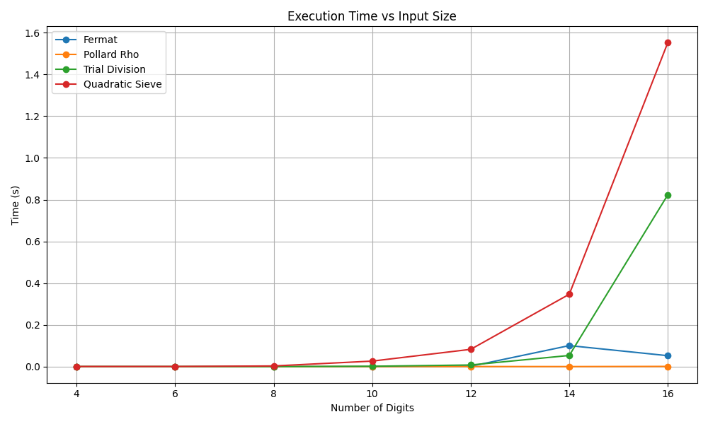
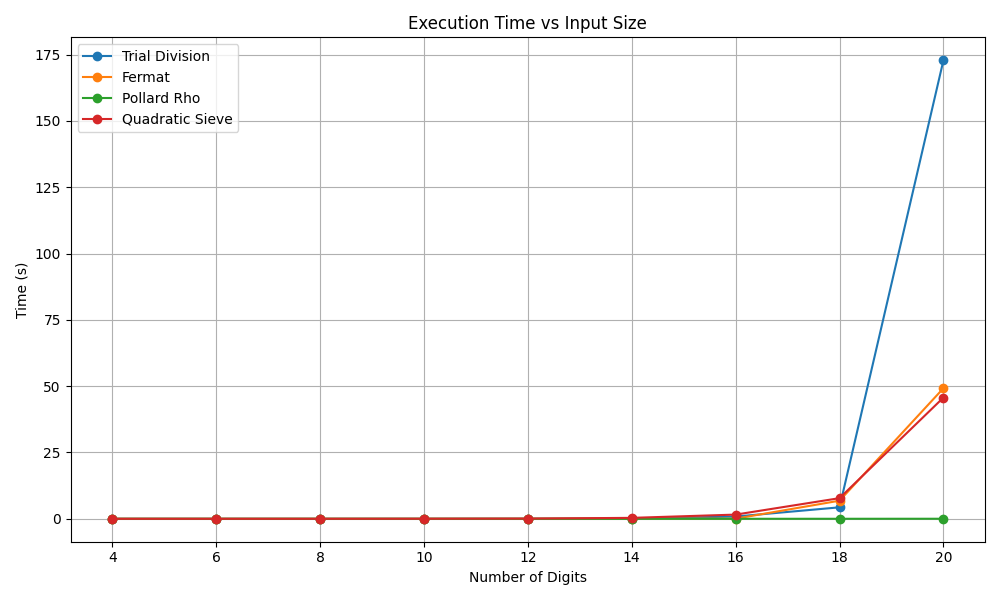
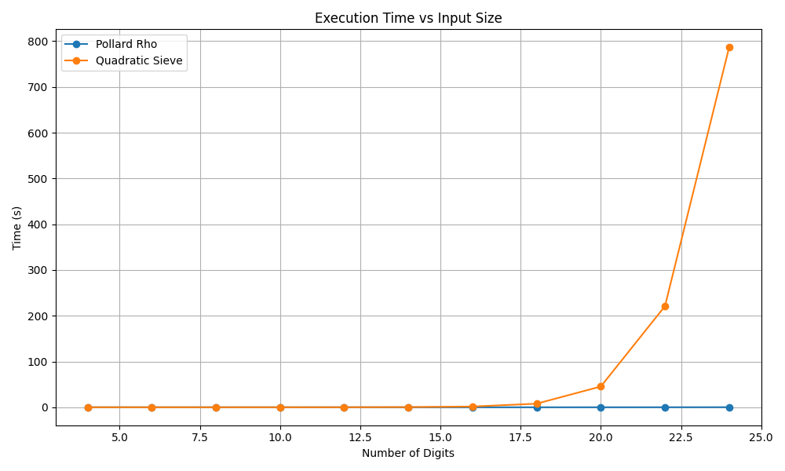
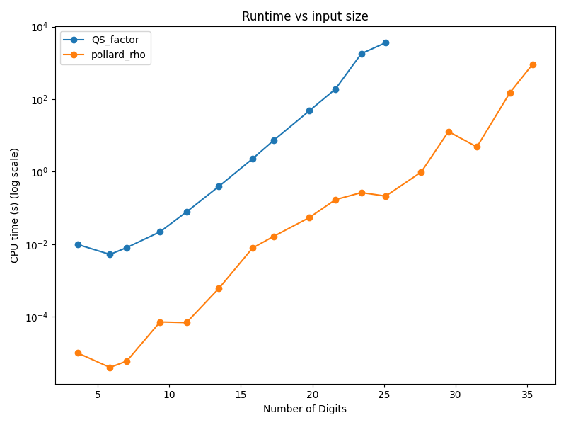

# Quadratic Sieve Factorization Implementation

This repository contains an educational implementation of the **Quadratic Sieve (QS)** algorithm, a classical integer factorization method first described by Carl Pomerance in 1982. The provided implementation utilizes the single-polynomial approach, known as the classical Quadratic Sieve.

## Overview of the Algorithm

The Quadratic Sieve is a general-purpose integer factorization algorithm that is especially effective for numbers with sizes ranging from 40 to approximately 100 digits. This implementation, however, employs only a single polynomial, making it simpler yet less efficient compared to the Self-Initializing Quadratic Sieve (SIQS).

## Implementation Details

The implementation includes:

- **Quadratic Sieve (QS)**: `QS.py` – single polynomial variant for educational purposes.
- **Pollard Rho**: `PollarRho.py`
- **Fermat Factorization**: `fermat.py`
- **Trial Division**: `trial.py`
- **Utility scripts**: 
  - `benchmark.py`
  - `main.py`
  - `creatingCompositeNumbers.py`
  - `plottingResults.py`

## Performance Benchmark

The algorithm performance was benchmarked against several classical algorithms:

- Trial Division
- Fermat Factorization
- Pollard Rho

### Benchmark Results

The benchmarks are based on integers ranging from a few digits up to 35 digits. Below are summarized benchmark plots:

#### Less than 16 Digits:



- Trial Division, Fermat, and Pollard Rho algorithms perform efficiently.
- Quadratic Sieve (QS) performance lags due to overhead from multiple stages.

#### Less than 20 Digits:



- Trial Division shows significant slowdowns around 20 digits.
- QS improves relatively but still lags behind Pollard Rho, which remains highly efficient.

#### QS vs Pollard Rho (25 Digits):



- Pollard Rho continues to perform faster.
- QS shows increased runtime.

#### QS vs Pollard Rho (35 Digits):



- Pollard Rho's performance noticeably slows.
- QS remains slow due to the limitations of using a single polynomial, highlighting the need for an optimized multi-polynomial approach such as SIQS.

## Limitations & Future Work

- The current QS implementation is limited by using a single polynomial, causing higher memory consumption and slower performance.
- Implementing the Self-Initializing Quadratic Sieve (SIQS) is the logical next step to enhance performance.

## How to Run
Install dependencies with:
```bash
pip install -r requirements.txt
```

To factor a number using the Quadratic Sieve, execute:

```bash
python3 main.py 
#or
python3 QS.py <integer_to_factor>
```
